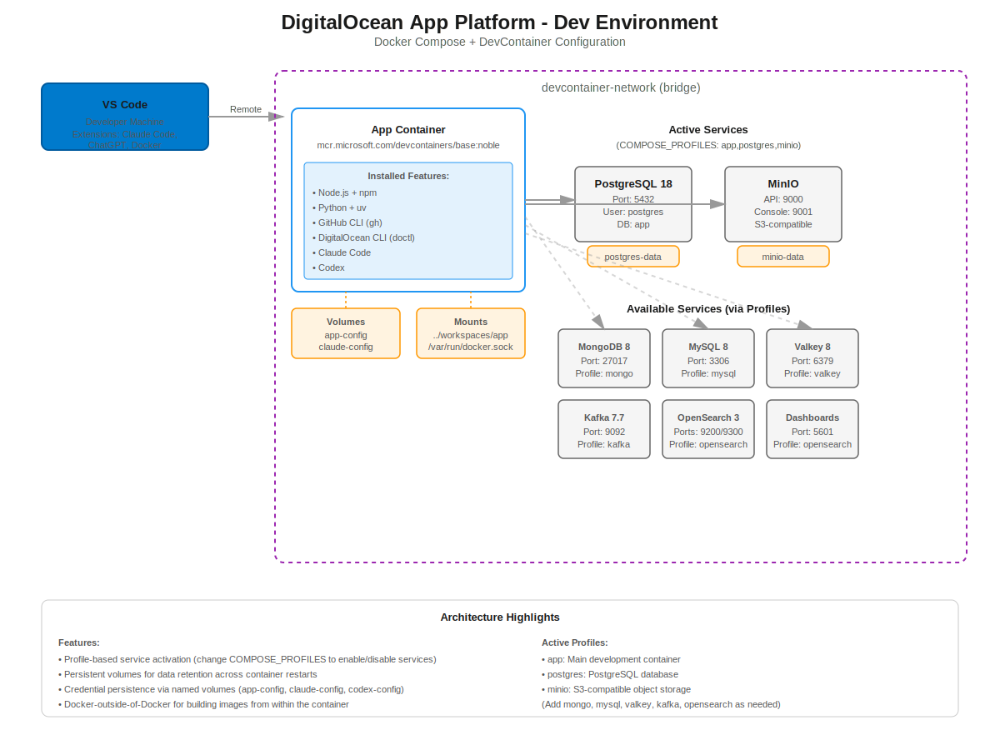

# Dev Container Setup

> **Experimental**: This is a personal project and is not officially supported by DigitalOcean. APIs may change without notice.

This is part of 3 projects to scale Agentic workflows with DigitalOcean App Platform. The concepts are generic and should work with any PaaS:
- Safe local sandboxing using DevContainers (this repo or [do-app-devcontainer](https://github.com/bikramkgupta/do-app-devcontainer))
- Rapid development iteration using hot reload ([do-app-hot-reload-template](https://github.com/bikramkgupta/do-app-hot-reload-template))
- Disposable environments using sandboxes for parallel experimentation and debugging ([do-app-sandbox](https://github.com/bikramkgupta/do-app-sandbox))

This repo provides a reusable `.devcontainer` setup for **DigitalOcean App Platform developers** who want a realistic, cloud-like development environment on their laptop.

Use this if:
- you are building or operating **DigitalOcean app platform** and want a standard, batteries-included dev environment for your teams, or
- you are an **application developer** and want to spin up all the platform dependencies (databases, queues, object storage, etc.) locally with one command.

All you need on your machine is **Docker (or any Docker-compatible runtime)** installed and running (e.g. Docker Desktop, Orbstack, Moby, or Podman with Docker API). You do **not** need to install Postgres, MongoDB, Kafka, MinIO, or other services manually; they are started for you via Docker Compose when the Dev Container comes up.

Once you open your project in this Dev Container, you should hit the “aha” moment quickly: your editor, runtimes (Node, Python, etc.), and backing services are all wired together and ready to use, without additional local setup.

This configuration uses **Docker Compose Profiles** to manage the various services (databases, message queues, etc.) available in the development environment. This allows you to keep the environment lightweight by only running the services you need.




## Getting Started

1. **Create the folder**  
   At the root of your project, create a `.devcontainer` folder.

2. **Copy the config files**  
   Put these files inside `.devcontainer`:
   - `devcontainer.json`
   - `docker-compose.yml`
   - `postcreate.sh`
   - `.env`

3. **Customize your setup**  
   Edit `devcontainer.json` to choose:
   - which services you want (databases, kafka, minio, etc.)
   - which language/tooling you need (Node, Python, Go, Rust, etc.)

4. **Open the folder in a Dev Container**  
   - Install the **Dev Containers** extension in your IDE (VS Code, Cursor, etc.).
   - Open your project folder in the IDE.
   - Run the Command Palette and choose **“Dev Containers: Open Folder in Container…”** (or the equivalent command in your IDE).

5. **Return to local**  
   When you’re done, either close the IDE or run **“Dev Containers: Reopen Folder Locally”** from the Command Palette.


## Default Features

By default, the app container includes the **Node.js** and **Python** development features.

To install additional languages or tools, open `.devcontainer/devcontainer.json` and update the `features` section and **rebuild the container** for changes to take effect. You can find more available features at [containers.dev/features](https://containers.dev/features).


## Default Services

By default, the following services are enabled via the `COMPOSE_PROFILES` environment variable in `devcontainer.json`:

- **PostgreSQL** (`postgres`)
- **MinIO** (`minio`)

## Enabling Additional Services

You can enable additional services in two ways:

### 1. Dynamic Start (Recommended)

Since this Dev Container has **Docker-out-of-Docker** enabled, you can start any service instantly from the terminal without rebuilding the container.

To start a specific service (e.g., MongoDB), run:

```bash
docker compose -f .devcontainer/docker-compose.yml --profile mongo up -d
```

Replace `mongo` with the profile name of the service you want to start.

**Available Profiles:**
- `postgres`
- `mongo`
- `mysql`
- `valkey`
- `kafka`
- `minio`

### 2. Persistent Configuration

To change the default set of services that start when the container opens:

1.  Open `.devcontainer/devcontainer.json`.
2.  Find the `containerEnv` section.
3.  Update the `COMPOSE_PROFILES` variable with a comma-separated list of profiles.

```json
"containerEnv": {
  "COMPOSE_PROFILES": "postgres,mongo,valkey"
}
```

4.  **Rebuild the Container** (Cmd/Ctrl + Shift + P -> "Dev Containers: Rebuild Container") for changes to take effect.

### Container Shutdown Behavior

By default, the `shutdownAction` in `devcontainer.json` is set to `"none"`. This means containers will keep running after you close the IDE. To change this behavior, modify the `shutdownAction` parameter. See comments in `devcontainer.json` for details.

### Docker & Compose Tips

If you're new to Docker or Docker Compose, it's helpful to keep a quick reference handy. Consider creating a custom command file in your IDE for common Docker operations.

### (Optional) Install the DevContainer CLI

If you frequently work with Dev Containers, consider installing the DevContainer CLI (under active development):

```bash
npm install -g @devcontainers/cli
```

## Running Multiple Workspaces

If you need to work on multiple instances of this project simultaneously (e.g., different branches, different configurations), you need to ensure workspace isolation to avoid container conflicts.

### Required: Unique Project Names

**IMPORTANT:** Each workspace must have a unique Docker Compose project name.

Edit `.devcontainer/docker-compose.yml` and set a unique name on line 1:

```yaml
name: my-unique-project-name  # Change this for each workspace

services:
  app:
    # ... rest of config
```

Example names:
- `my-app-main`
- `my-app-feature-x`
- `my-app-testing`

### Port Conflicts

This setup uses dynamic port assignment to prevent port conflicts when running multiple workspaces. Docker automatically assigns available ports.

**Finding assigned ports:**

```bash
# View all containers with port mappings
docker compose -f .devcontainer/docker-compose.yml ps

# Get specific port for a service
docker compose -f .devcontainer/docker-compose.yml port postgres 5432
docker compose -f .devcontainer/docker-compose.yml port minio 9001
```

**Connecting from your host machine:**

Use the dynamically assigned port shown in `docker compose ps`. For example:
- Postgres: `psql -h 127.0.0.1 -p 54321 -U postgres -d app` (where 54321 is the assigned port)
- MinIO Console: Open `http://localhost:54322` in browser (where 54322 is the assigned port)

**Inside the container:**

Your applications connect using standard ports and service names:
- Database: `postgres:5432`
- MinIO: `minio:9000`

### Copying .devcontainer to a New Workspace

When setting up a new workspace:

1. Copy the entire `.devcontainer/` folder to your new project
2. **MUST DO:** Edit `docker-compose.yml` and change the `name:` field (line 1)
3. Review and update `.env` if needed
4. Open the workspace in a Dev Container

### Understanding COMPOSE_PROFILES

You'll notice `COMPOSE_PROFILES` is defined in two places:

**`.devcontainer/.env`:**
- Used when running `docker compose` from your **host machine**
- Example: `docker compose -f .devcontainer/docker-compose.yml ps`

**`devcontainer.json` → `containerEnv`:**
- Environment variables available **inside the dev container**
- Used when running `docker compose` from within the container
- VS Code Dev Containers reads this to know which services to start

**Best Practice:** Keep both values in sync to ensure consistent behavior.

